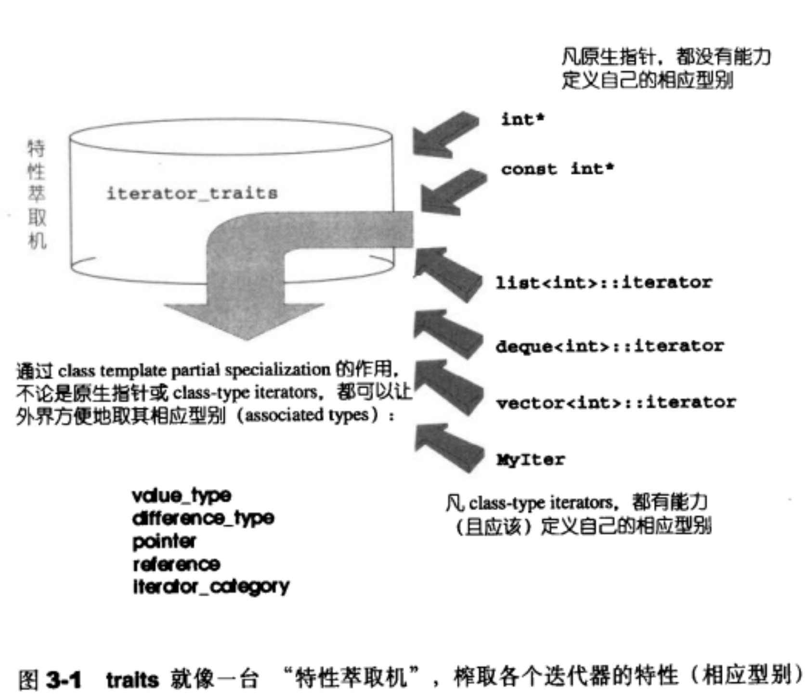

## `traits`编程方法
`STL`中，容器与算法独立设计，两者通过迭代器实现连接。

在设计模式中，`iterator`描述为：
**一种能够顺序访问容器中每个元素的方法，使用该方法不能暴露容器内部的表达式。萃取技术主要用来解决和`iterator`相关的问题。**
对迭代器来说是一种智能指针，拥有一般指针的所有特点能够对其进行`*和->`操作。
`traits`结构的定义：
```cpp
template <class _Tp>
struct iterator_traits<_Tp*>{
  typedef typename _Tp::value_type value_type;
  typedef typename _Tp::pointer pointer;
  typedef typename _Tp::reference reference;
  typedef typename _Tp::iterator_category iterator_category;
};
```
### `template`参数推导
在算法中应用迭代器，首先可能遇到类型识别(`associated type`)(迭代器所指类别)。
解决方案：
**利用`function template`的参数推导机制。**
例如：
如果`T`是指向某个特定对象的指针，那么在`func`中需要指向对象的型别如何处理？
通过模板的参数推导机制可以完成任务。
```cpp
template <class T>
inline void func(T iter) {
  func_impl(iter, *iter); // 传入iter和iter所指向的值，class自动推导
}
```
通过模板的参数推导机制，我们可以得到指针所指的对象类型。
```cpp
template <class T, class I>
void func_impl(T iter, I t){
  I tmp; // 迭代器所指的物的类别
  // ... 功能实现
}

int main(){
  int i;
  func(&i);
}
```
模板的参数类型推导只能推导参数类型。不能推导返回值类型。
#### 声明内嵌类型
迭代器所指的对象类型，称为迭代器的`value type`。
```cpp
template <class T>
struct MyIter{
  typedef T value_type; // 内嵌声明型别
  T *ptr; 
  MyIter(T *p = 0):ptr(p){}
  T &operator*()const {
    return *ptr;
  }
};

template <class I>
typename I::value_type func(I iter) {
  std::cout <<"class version" << std::endl;
  return *iter;
}

int main() {
  // ... 
  MyIter<int> (8);
  cout << func(ite);
}
```
上述算法无法接收原生指针类型。
#### `traits`
在使用`typedef typename T::value_type `时，无法接收原生指针。因为原生指针不存在`value_type`的内嵌类型。
1. 偏特化
简单处理，增加函数偏特化处理，如下：
```cpp
template <class T>
struct MyIter{
  typedef T value_type; // 内嵌声明型别
  T *ptr; 
  MyIter(T *p = 0):ptr(p){}
  T &operator*()const {
    return *ptr;
  }
};

template <class I>
typename I::value_type func(I iter) {
  std::cout <<"class version" << std::endl;
  return *iter;
}

template <class T>
T func(T* iter) {
  return *iter;
}

template <class T>
T func(const T *iter) {
  return *iter;
}

int main() {
  // ... 
  MyIter<int> (8);
  cout << func(ite);
}
```
偏特化的方法需要针对不同基础类型声明对应的方法，代码冗余。
2. 加入中间层
  
利用中间层`iterator_traits`固定`func`的形式，减少重复代码量。
```cpp
#include <iostream>

template <class T>
struct MyIter {
  typedef T value_type;
  T *       ptr;
  MyIter(T *p = nullptr) : ptr(p) {
  }

  T &operator*() const {
    return *ptr;
  }
};

// class type
template <class T>
struct iterator_traits {
  typedef typename T::value_type value_type;
};

// 偏特化1
template <class T>
struct iterator_traits<T *> {
  typedef T value_type;
};

// 偏特化2
template <class T>
struct iterator_traits<const T *> {
  typedef T value_type;
};

/**
 * @brief 首先询问iteartor_traits<T>::value_type 特化版本进入特化版本处理；
 *        否则进入正常处理流程
 * @tparam T
 * @param  iter             My Pan doc
 * @return T::value_type
 * */
template <class T>
typename iterator_traits<T>::value_type func(T iter) {
  return *iter;
}

int main(int argc, char **argv) {
  MyIter<int> iter(new int(8));
  std::cout << func(iter) << std::endl;
  int *p = new int(2);
  std::cout << func(p) << std::endl;
  const int k = 10;
  std::cout << func(&k) << std::endl;
}
```
通过内嵌类型的定义,我们知道了获知`iterator`类型的方法。通过`traits`技法，将原生类型和自定义类型的`iterator`的定义统一起来。

