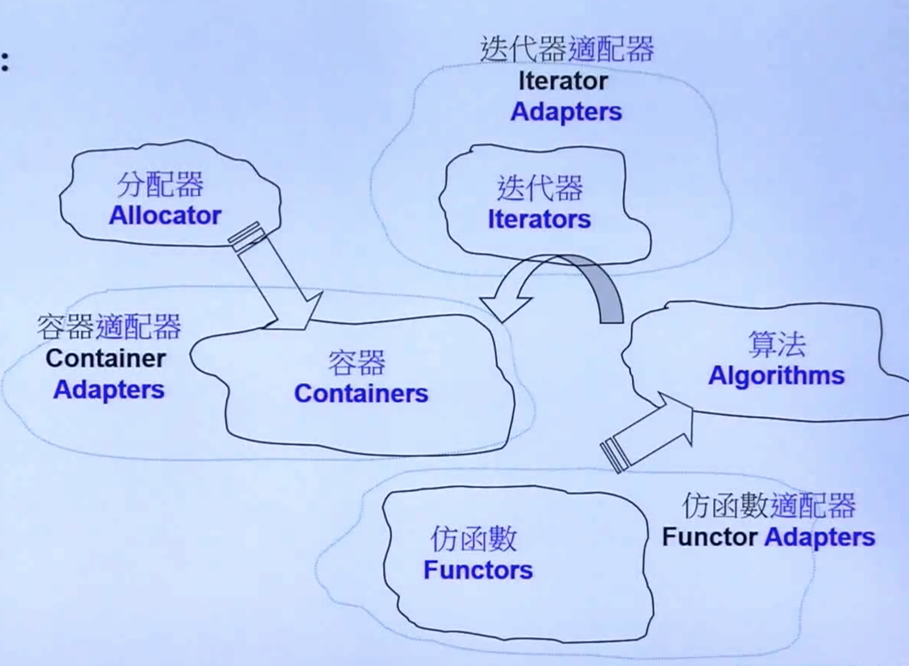
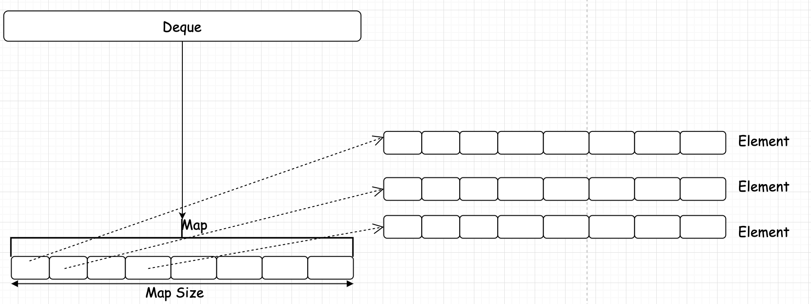

## `STL`六大部件
* 容器(`Containers`)
* 分配器(`Allocators`)
* 算法(`Algorithms`)
* 迭代器(`Iterators`)
* 适配器(`Adapters`)
* 仿函数(`Functors`)

  

### 容器测试
#### 数组(`Array`)
```cpp
/**
 * @Copyright (c) 2021  koritafei
 * @file ArrayDemo.cc
 * @brief STL Array Test
 * @author koritafei (koritafei@gmail.com)
 * @version 0.1
 * @date 2021-04-18 10:04:37
 *
 * */

#include <array>
#include <cmath>
#include <cstdlib>
#include <ctime>
#include <iostream>

namespace TestSTL {
const int DEFAULTSIZE = 1000;

void TestArray() {
  std::cout << "Test Array .... " << std::endl;
  std::array<long, DEFAULTSIZE> c;

  clock_t timeStart = std::clock();

  for (int i = 0; i < DEFAULTSIZE; i++) {
    c[i] = rand();
  }

  std::cout << "Milli-seconds : " << (clock() - timeStart) << std::endl;
  std::cout << "Array size : " << c.size() << std::endl;
  std::cout << "Array front : " << c.front() << std::endl;
  std::cout << "Array back : " << c.back() << std::endl;
  std::cout << "Array data : " << c.data() << std::endl;
}
}  // namespace TestSTL

int main(int argc, char **argv) {
  TestSTL::TestArray();
}
```
#### `vector`测试
```cpp
/**
 * @Copyright (c) 2021  koritafei
 * @file VectorDemo.cc
 * @brief Vector TEST
 * @author koritafei (koritafei@gmail.com)
 * @version 0.1
 * @date 2021-04-18 11:04:30
 * 
 * */

#include <cstdlib>
#include <iostream>
#include <vector>
#include <ctime>

namespace TestSTL{

void TestVector() {
  std::cout << "Test Vector" << std::endl;
  std::vector<std::string> v;
  char buff[10];
  clock_t timeStart = std::clock();

  for (int i = 0; i < 10000;i++) {
    try{
      snprintf(buff, 10, "%d", rand());
      v.push_back(std::string(buff));
    } catch (std::exception &p) {
      std::cout << "i = " << i << " " << p.what() << std::endl;
      abort();
    }
  }

  std::cout << "Milli-seconds : " << (clock() - timeStart) << std::endl;
  std::cout << "vector size : " << v.size() << std::endl;
  std::cout << "vector front : " << v.front() << std::endl;
  std::cout << "vector back : " << v.back() << std::endl;
  std::cout << "vector data : " << v.data() << std::endl;
}

}

int main(int argc, char **argv) {
  TestSTL::TestVector();
}
```
#### `deque`
双向开口链表。底层实现如下图：
  
`deque`又被称为分段容器，每一段内存放数据的空间连续，但段间地址可能不连续。
可以理解为：
`deque`内部为一个`void *`的数组，该`void *`数组的每个元素，指向一段连续的地址空间，存放数据。
### `STL`内核分析
`allocator`代码分析：
```cpp
/**
 * @Copyright (c) 2021  koritafei
 * @file defalloc.h
 * @brief allocator
 * @author koritafei (koritafei@gmail.com)
 * @version 0.1
 * @date 2021-04-19 14:04:39
 *
 * */

#ifndef __DE_FALLOC_H__
#define __DE_FALLOC_H__

#include <cstddef>
#include <cstdlib>
#include <iostream>
#include <limits>
#include <new>

#include "algobase.h"

template <class T>
inline T *allocate(ptrdiff_t size, T *) {
  std::set_new_handler(0);  // new failed, call this function
  T *tmp = (T *)(::operator new((size_t)(size * sizeof(T))));
  if (0 == tmp) {
    std::cerr << "out of memory" << std::endl;
    exit(1);
  }

  return tmp;
}

template <class T>
inline void deallocate(T *buffer) {
  ::operator delete(buffer);
}

template <class T>
class allocator {
public:
  typedef T         value_type;
  typedef T *       pointer;
  typedef const T & const_pointer;
  typedef T &       reference;
  typedef const T & const_reference;
  typedef size_t    size_type;
  typedef ptrdiff_t difference_type;

  pointer allocate(size_type n) {
    return ::allocate((difference_type)n, (pointer)0);
  }

  void deallocate(pointer p) {
    ::deallocate(p);
  }

  pointer address(reference x) {
    return (pointer)&x;
  }

  const_pointer const_address(const_reference x) {
    return (const_pointer)&x;
  }

  size_type init_page_size() {
    return std::max(size_type(1), size_type(UINT_MAX) / sizeof(T));
  }
};

template <>
class allocator<void> {
public:
  typedef void *pointer;
};

#endif
```

