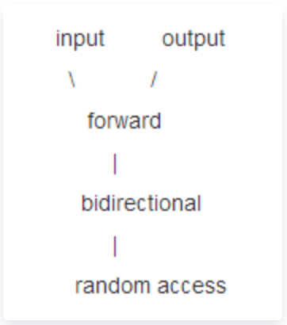
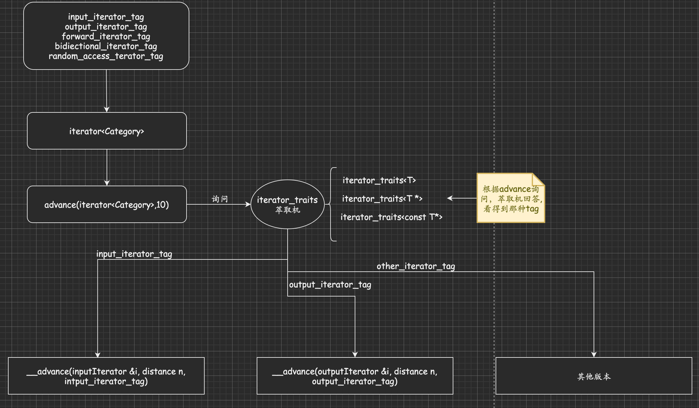

## `iterator_traits`
1. 利用萃取机简单实现一个`iterator_category`
迭代器是指向序列元素的指针的一种抽象。通过使用迭代器,我们可以访问序列中的某个元素、改变序列中的某个值、使迭代器向前或向后行走等等。
迭代器常见的五种类型：
* `value_type`;
* `defference_type`;
* `reference_type`;
* `pointer_type`等。

`iterator_category`也有五种类型：
* 单向移动只读迭代器`input iteartor`;
* 单向移动只写迭代器`ouput iterator`;
* 单向移动读写迭代器`forward iterator`;
* 双向移动读写迭代器`bidrectional iterator`.
  
设计如下：
如果`traits`有能力萃取出迭代器种类，我们用迭代类型作为函数的第三个参数。
相应型别为`class type`。

